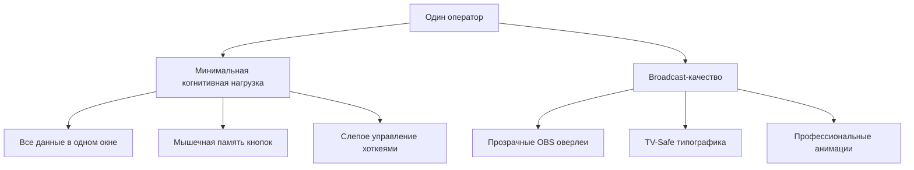
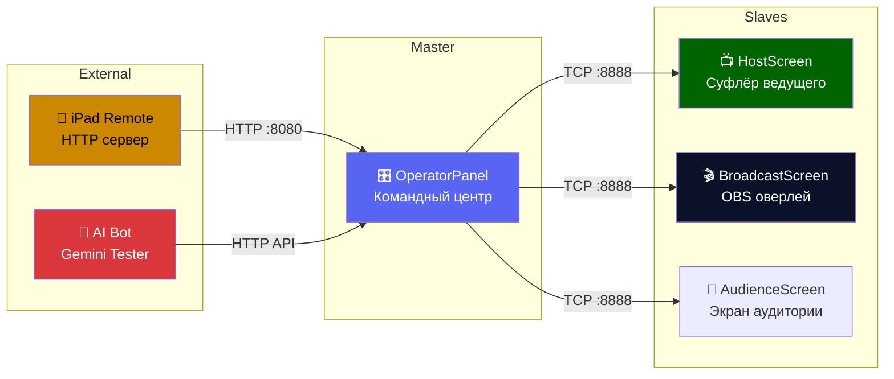
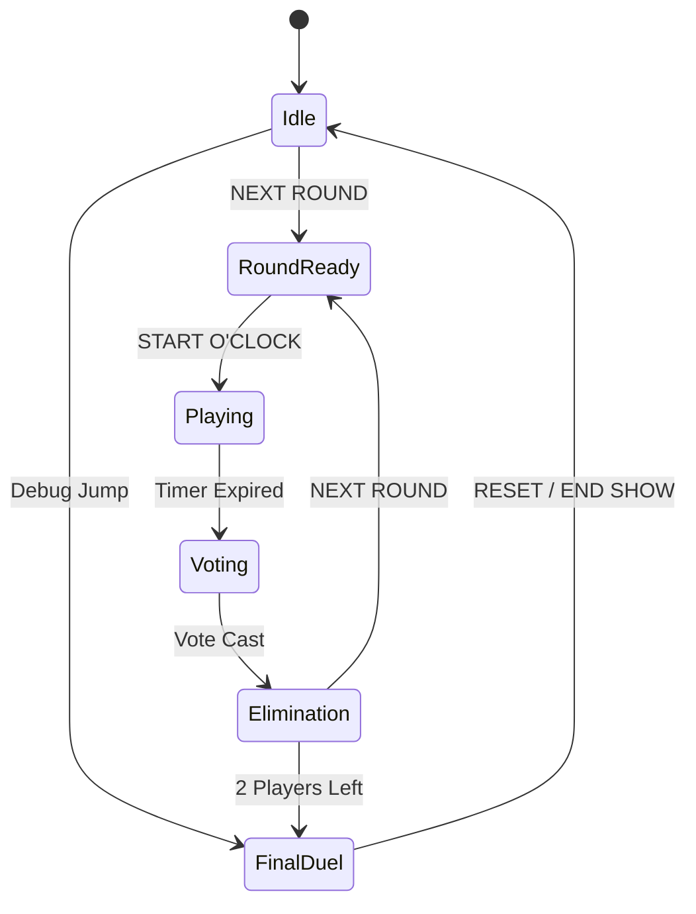
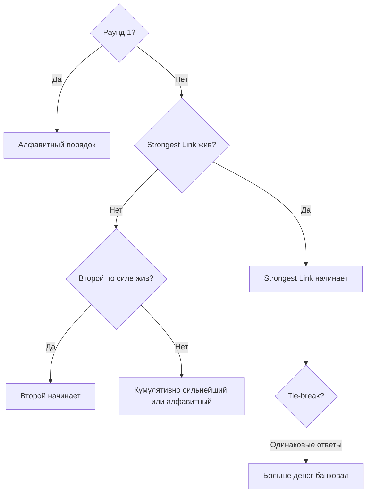
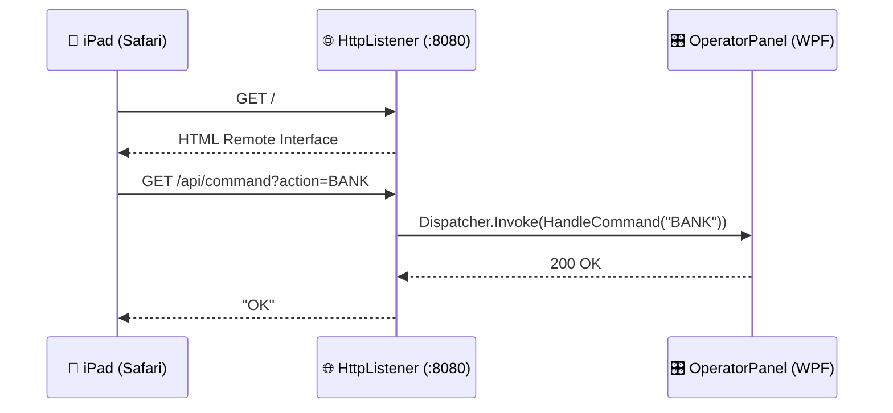

# 📖 ЭНЦИКЛОПЕДИЯ ПРОЕКТА: Antigravity Broadcast Suite
## «Слабое Звено» — Полная Техническая Документация

> [!NOTE]
> Дата генерации: 13 марта 2026  
> Платформа: .NET 10.0 · WPF · C# · NAudio 2.2.1 · QRCoder 1.7.0  
> Путь проекта: `I:\WEAKEST LINK SOPFTWARE AI TESTERING FINALE`

---

## 📑 Оглавление

1. [Обзор платформы](#1-обзор-платформы)
2. [Архитектура системы](#2-архитектура-системы)
3. [Структура файлов проекта](#3-структура-файлов-проекта)
4. [Многоэкранная система](#4-многоэкранная-система)
5. [Game Engine — Ядро игровой логики](#5-game-engine--ядро-игровой-логики)
6. [Раунды и управление временем](#6-раунды-и-управление-временем)
7. [Банковская цепочка (Money Chain)](#7-банковская-цепочка-money-chain)
8. [Финальная дуэль (Head-to-Head)](#8-финальная-дуэль-head-to-head)
9. [Sudden Death — Внезапная смерть](#9-sudden-death--внезапная-смерть)
10. [Система управления вопросами](#10-система-управления-вопросами)
11. [Статистика и аналитика игроков](#11-статистика-и-аналитика-игроков)
12. [Сетевой протокол (TCP)](#12-сетевой-протокол-tcp)
13. [Аудио-движок (NAudio)](#13-аудио-движок-naudio)
14. [iPad Web Remote — Удалённый пульт](#14-ipad-web-remote--удалённый-пульт)
15. [UI/UX Дизайн-система «Obsidian»](#15-uiux-дизайн-система-obsidian)
16. [Broadcast-оверлеи (OBS Studio)](#16-broadcast-оверлеи-obs-studio)
17. [Горячие клавиши оператора](#17-горячие-клавиши-оператора)
18. [Экстренное управление (Panic Buttons)](#18-экстренное-управление-panic-buttons)
19. [AI Bot — Автоматическое тестирование](#19-ai-bot--автоматическое-тестирование)
20. [Инструменты разработчика](#20-инструменты-разработчика)
21. [Паттерны проектирования (Каталог)](#21-паттерны-проектирования-каталог)
22. [Цветовая палитра (Color Bible)](#22-цветовая-палитра-color-bible)
23. [Troubleshooting — Решение проблем](#23-troubleshooting--решение-проблем)
24. [Этапы развития (Milestones)](#24-этапы-развития-milestones)
25. [Глоссарий терминов](#25-глоссарий-терминов)

---

## 1. Обзор платформы

**Antigravity Broadcast Suite** — унифицированная платформа для профессиональных C#/WPF симуляций телевизионных игровых шоу. Разработана для **одного оператора**, который управляет вопросами, банком, таймерами и звуком одновременно в условиях прямого эфира.

### Философия проектирования



### Ключевые характеристики

| Параметр | Значение |
|---|---|
| **Фреймворк** | .NET 10.0-windows (WPF) |
| **Язык** | C# (latest) |
| **Аудио** | NAudio 2.2.1 (WaveOutEvent + AudioFileReader) |
| **QR-коды** | QRCoder 1.7.0 |
| **Сеть** | TCP (порт 8888) / HTTP (порт 8080/8081) |
| **Целевое разрешение** | 1920×1080 (масштабируется через Viewbox) |
| **Управление** | Один оператор + опциональный iPad Remote |

---

## 2. Архитектура системы

### Master-Slave модель



### Слои приложения

```
┌─────────────────────────────────────────────────────┐
│                    VIEWS (XAML + Code-Behind)        │
│  OperatorPanel │ HostScreen │ BroadcastScreen │ ...  │
├─────────────────────────────────────────────────────┤
│                    CORE (Логика)                     │
│  GameEngine │ GameState │ Models │ Analytics         │
├─────────────────────────────────────────────────────┤
│                   SERVICES                           │
│  QuestionProvider │ StatsAnalyzer │ StatsExporter    │
├─────────────────────────────────────────────────────┤
│                   NETWORK                            │
│  GameServer │ GameClient │ WebRemoteController       │
│  AiBotTester │ GeminiBotClient │ GeminiTestPlayer    │
├─────────────────────────────────────────────────────┤
│                    AUDIO                             │
│  AudioManager │ LoopStream                           │
└─────────────────────────────────────────────────────┘
```

---

## 3. Структура файлов проекта

### Директории

| Папка | Назначение | Ключевые файлы |
|---|---|---|
| `Views/` | WPF-окна (XAML + Code-Behind) | [OperatorPanel.xaml](file:///I:/WEAKEST%20LINK%20SOPFTWARE%20AI%20TESTERING%20FINALE/Views/OperatorPanel.xaml) (237KB!), HostScreen, BroadcastScreen |
| `Core/` | Движок, состояния, модели | [GameEngine.cs](file:///I:/WEAKEST%20LINK%20SOPFTWARE%20AI%20TESTERING%20FINALE/Core/GameEngine.cs) (35KB), GameState.cs |
| `Core/Models/` | DTO и модели данных | QuestionData.cs, QuestionModel.cs, BotDecision.cs |
| `Core/Services/` | Сервисы бизнес-логики | QuestionProvider.cs |
| `Core/Analytics/` | Аналитика и статистика | StatsAnalyzer.cs (17KB), StatsExporter.cs |
| `Network/` | Сеть (TCP/HTTP/Bot) | GameServer.cs, GameClient.cs, WebRemoteController.cs (26KB) |
| `Audio/` | Звуковой движок | AudioManager.cs (17KB), LoopStream.cs |
| `Assets/` | Графика, звуки | Текстуры (BANK.png, TIMER.png, moneytree_*.png) |
| `Assets/Images/` | Индикаторы (GOOD/BAD/NORMAL.png) | 31 файл, включая финальные текстуры |
| `Tools/` | Python-утилиты | analyze_sync.py, find_first_beat.py, layout_editor.html |
| `docs/` | Документация (35 файлов) | ARCHITECTURE.md, PROGRESS_WL.md, GEMINI_ONBOARDING.md |

### Ключевые файлы данных

| Файл | Назначение |
|---|---|
| `questions.json` (62KB) | Банк вопросов раундов (RU) |
| `questions_en.json` | Банк вопросов раундов (EN) |
| `final_questions.json` | Вопросы для финальной дуэли (RU) |
| `final_questions_en.json` | Вопросы для финальной дуэли (EN) |

### Размеры окон (по объёму кода)

| Компонент | XAML | Code-Behind | Суммарно |
|---|---|---|---|
| **OperatorPanel** | 237 KB | 305 KB | **543 KB** 🏆 |
| BroadcastWindow | 15 KB | 38 KB | 53 KB |
| HostScreenPremium | 22 KB | 26 KB | 48 KB |
| HostScreenModernPremium | 15 KB | 19 KB | 34 KB |
| WebRemoteController | — | 26 KB | 26 KB |

---

## 4. Многоэкранная система

### 4.1 Operator Panel — Командный центр

> [!IMPORTANT]
> Самый масштабный компонент (543 KB кода). Управляет **всей** игрой.

**Функции:**
- Настройка команды (добавление/удаление игроков)
- Управление раундами (таймеры, вопросы, вердикты)
- Банковская система (цепочка 8 уровней)
- Финальная дуэль (Head-to-Head + Sudden Death)
- Аналитика и статистика в реальном времени
- Broadcast-управление (открытие/закрытие оверлеев)
- Сервисные функции (Panic buttons, Reset, Close)

**Интерфейс «Боевой Кокпит» (Battle Cockpit):**
```
┌──────────────────────────────────────────┐
│           │                              │
│  ЦЕПОЧКА  │    В каком году была         │
│           │    основана Москва?          │
│   ₽1 000  │                              │
│   ₽2 000  │    ОТВЕТ: 1147              │
│   ₽5 000  │                              │
│   ₽10 000 │ ──────────────────────────── │
│   ₽20 000 │ [ВЕРНО][БАНК] [НЕВЕР][ПАСС]  │
│   ₽30 000 │  ENTER SPACE    DEL   BACK   │
│   ₽40 000 │                              │
│   ₽50 000 │                              │
└───────────┴──────────────────────────────┘
   Col 0 (180px)        Col 1 (*)
```

### 4.2 Host Screen — Суфлёр ведущего

Высококонтрастный TV-промптер с «холодно-синей» эстетикой:

| Блок | Цвет | FontSize |
|---|---|---|
| Фон | Deep Space Blue `#050510` | — |
| Вопрос | Navy Dark `#0A1128` | 88pt+ |
| Ответ | Red `#C10000` | 88pt |
| Таймер | Forest Green `#006400` | 72pt |
| Bank Now | Royal Blue `#0000B8` | Bold |
| Total Bank | Burgundy `#4A0020` | Bold |

### 4.3 Broadcast Screen — OBS оверлей

Прозрачное окно для захвата в OBS Studio:
- `WindowStyle="None"`, `AllowsTransparency="True"`, `Background="Transparent"`
- Разрешение-независимость через `Viewbox Stretch="Uniform"` (1920×1080)
- Ассеты загружаются через `pack://siteoforigin:,,,/`

### 4.4 Дополнительные экраны

| Экран | Назначение |
|---|---|
| **AudienceScreen** | Экран для аудитории в студии |
| **BroadcastWindow** | Расширенное окно broadcast |
| **RoundStatsWindow** | Статистика раунда |
| **WinWinner** | Финальная заставка победителя |
| **QuestionEditorWindow** | Редактор вопросов |
| **DarkMessageBox** | Кастомный MessageBox в стиле Obsidian |

---

## 5. Game Engine — Ядро игровой логики

### Конечный автомат (State Machine)



### Transition Validation Pattern

Переходы валидируются через `TransitionTo(GameState)` — несанкционированные переходы выбрасывают `InvalidOperationException`. Специально разрешены Debug-переходы:
- `Idle → FinalDuel` (для быстрого тестирования)
- `FinalDuel → Idle` (для сброса)

### GameState перечисление

```csharp
public enum GameState {
    Idle,           // Ожидание настройки команды
    RoundReady,     // Раунд подготовлен, ждём START
    Playing,        // Активная игра (таймер тикает)
    Voting,         // Голосование за Слабое Звено
    Elimination,    // Показ выбывшего игрока
    FinalDuel       // Финальная дуэль (Head-to-Head)
}
```

---

## 6. Раунды и управление временем

### Хронометраж

| Раунд | Время | Игроков |
|---|---|---|
| Раунд 1 | 150 сек | 8 |
| Раунд 2 | 140 сек | 7 |
| Раунд 3 | 130 сек | 6 |
| Раунд 4 | 120 сек | 5 |
| Раунд 5 | 110 сек | 4 |
| Раунд 6 | 100 сек | 3 |
| **Пред-финальный** | **90 сек** | **2** (банк ×2) |

### Automated Round Preparation (Команда «NEXT ROUND»)

Единая команда выполняет 6 шагов:

1. **UI Clearing** — очистка предыдущих вопросов/ответов
2. **Engine Increment** — инкремент номера раунда, сброс статистики
3. **Timer Initialization** — автоматическое уменьшение на 10 сек
4. **Smart Start** — выбор стартового игрока (алгоритм ниже)
5. **Network Sync** — синхронизация по TCP
6. **Question Buffering** — предзагрузка первого вопроса

### Smart Start — Алгоритм выбора стартового игрока



### Пред-финальный раунд (2 игрока)

- Активируется динамически при `ActivePlayers.Count == 2`
- Всегда 90 секунд
- Банк раунда **удваивается** перед добавлением к TotalBank
- Голосование пропускается → сразу `FinalDuel`

---

## 7. Банковская цепочка (Money Chain)

### 8 ступеней

| Шаг | Сумма |
|---|---|
| 1 | ₽1 000 |
| 2 | ₽2 000 |
| 3 | ₽5 000 |
| 4 | ₽10 000 |
| 5 | ₽20 000 |
| 6 | ₽30 000 |
| 7 | ₽40 000 |
| 8 | ₽50 000 |

### Цветовой стандарт (Оператор)

| Состояние | Цвет | Код |
|---|---|---|
| **Активный уровень** | Gold + Yellow border | `#CC8800` |
| **Неактивный уровень** | Dark Gray | `#252525` / border `#444` |

> [!WARNING]
> **НИКОГДА** не использовать Green для цепочки — он зарезервирован для вердикта «Верно».

### Auto-Banking

При достижении 8-го шага банк автоматически фиксируется.

### Host Screen — Look-Ahead

- **Bank Now**: значение на `currentChainIndex - 1`
- **Next Sum**: значение на `currentChainIndex`

### Broadcast — Canvas-Based Engine

Программная анимация через `DoubleAnimation` на `Canvas.BottomProperty`:
- **Стандартный интервал**: 95px между ступенями
- **Перекрытие в стеке**: 25px
- **Easing**: QuadraticEase (EaseInOut) / ElasticEase (Oscillations=1)

---

## 8. Финальная дуэль (Head-to-Head)

### Структура

5 пар вопросов (по одному каждому игроку). Победитель — больше правильных ответов.

### Bulletproof Question Pattern

- `_finalQuestions` — **static** (переживает пересоздание engine)
- Извлечение через **Modulo Pattern**: `index % list.Count`
- **Hardcoded Fallback**: 5 запасных вопросов если список пуст

### Static UI Reference Pattern (Индикаторы)

```csharp
// XAML: P1_C1, P1_C2, P1_C3, P1_C4, P1_C5
private Ellipse[] _p1Circles;

public OperatorPanel() {
    InitializeComponent();
    _p1Circles = new[] { P1_C1, P1_C2, P1_C3, P1_C4, P1_C5 };
}

private void UpdateFinalCirclesUI() {
    for (int i = 0; i < 5; i++) {
        if (i < _engine.Player1FinalScores.Count) {
            var score = _engine.Player1FinalScores[i];
            _p1Circles[i].Fill = score == true ? Brushes.Green :
                               (score == false ? Brushes.Red : Brushes.Transparent);
        }
    }
}
```

### Unified Refresh Pattern

Весь UI финала обновляется через **единую точку** `RefreshFinalUI()`:

```csharp
private void BtnDuelCorrect_Click(object sender, RoutedEventArgs e) {
    _engine.ProcessFinalAnswer(true);
    RefreshFinalUI();  // Единственный вызов обновления
}

private void RefreshFinalUI() {
    UpdateFinalCirclesUI();          // 1. Кружки
    if (string.IsNullOrEmpty(_engine.FinalWinner))
        _engine.GetNextFinalQuestion(); // 2. Вопрос
    UpdateDuelUI();                  // 3. Текст + Host Sync
}
```

---

## 9. Sudden Death — Внезапная смерть

### Условие активации

Оба игрока завершили 5 вопросов **И** набрали одинаковое количество очков.

### Визуальные признаки

- `TurnTextBlock.Foreground` → **Red**
- Таблица индикаторов **скрывается** на Broadcast
- Фоновая музыка меняется на `sudden_death_bed.mp3` (однократно через latch `_isSuddenDeathMusicPlayed`)

### Логические гарантии

```csharp
// Count >= 5 Pattern — защита от преждевременного срабатывания
bool isComplete = scores.All(r => r != null) && scores.Count >= 5;
```

---

## 10. Система управления вопросами

### JSON формат

```json
{
    "Question": "В каком году была основана Москва?",
    "Answer": "1147",
    "AcceptableAnswers": "1147, двенадцатый век"
}
```

### QuestionProvider.cs

- Загрузка из `questions.json` / `questions_en.json`
- Десериализация с `PropertyNameCaseInsensitive = true`
- CopyToOutputDirectory: `PreserveNewest`

### Expanded Decision Support (Финал)

Оператор видит **основной ответ** + **допустимые варианты**:
> «Париж (франция, paris)»

---

## 11. Статистика и аналитика игроков

### Метрики (PlayerStatView)

| Метрика | Описание |
|---|---|
| **Correct** | Количество верных ответов |
| **Incorrect** | Количество неверных ответов |
| **Passes** | Количество пасов |
| **Banked** | Сумма заработанных денег |

### Аналитические компоненты

| Файл | Размер | Функция |
|---|---|---|
| `StatsAnalyzer.cs` | 17 KB | Расчёт Strongest/Weakest Link |
| `StatsExporter.cs` | 10 KB | Экспорт статистики |
| `RoundStatsWindow` | 28 KB | Визуальное окно статистики |

---

## 12. Сетевой протокол (TCP)

### Порт: 8888

### Формат сообщений

Строка, завершённая `\n`. Поля разделены `|`.

### Команды

| Команда | Описание |
|---|---|
| `STATE\|{GameState}` | Изменение состояния игры |
| `SET_STATE\|{GameState}` | Принудительная установка состояния |
| `QUESTION\|{text}\|{answer}\|{number}` | Обновление вопроса |
| `UPDATE_BANK\|{chainIndex}\|{banked}` | Синхронизация банка |
| `DUEL_UPDATE\|{p1}\|{p2}\|{s1}\|{s2}` | Обновление дуэли |
| `ELIMINATE\|{name}` | Показ выбывшего |
| `CLEAR_ELIMINATION` | Скрытие экрана выбывания |
| `WINNER\|{name}\|{amount}` | Финальная заставка |
| `HOST_MESSAGE\|{text}` | Сообщение для ведущего |
| `CLEAR_BROADCAST` | Очистка эфира |
| `RESET_GAME` | Полный сброс |

### CSV-формат очков дуэли

`1,0,1,1,-1` где: `1`=Верно, `0`=Неверно, `-1`=Ещё нет

### Sync-on-Demand Pattern

При открытии Slave-окна Master немедленно пушит текущее состояние:

```csharp
var hostScreen = new HostScreen();
hostScreen.Show();
// Immediate State Push — нет "пустого экрана"
hostScreen.UpdateQuestion(_engine.CurrentQuestion);
hostScreen.UpdateTimer(FormatTime(_timeLeftSeconds));
hostScreen.UpdateBank(_engine.ChainIndex, _engine.RoundBank);
```

---

## 13. Аудио-движок (NAudio)

### AudioManager.cs (17 KB)

| Принцип | Описание |
|---|---|
| **One Active Track** | Новый трек автоматически останавливает предыдущий |
| **Continuous Bed** | Фоновая музыка НЕ прерывается кнопками Correct/Wrong |
| **Stage-Only Transitions** | Музыка меняется только при смене состояния |
| **Hardware** | WaveOutEvent + AudioFileReader для MP3 |

### Continuous Audio Bed Pattern (Финал)

```csharp
// ❌ НЕПРАВИЛЬНО — прерывает фон при каждом клике
private void BtnDuelCorrect_Click(...) {
    _audioManager.StopAll();  // НЕТ!
    _audioManager.Play("correct.mp3");
}

// ✅ ПРАВИЛЬНО — фон играет непрерывно
private void BtnDuelCorrect_Click(...) {
    _engine.ProcessFinalAnswer(true);
    RefreshFinalUI();  // Без аудио-логики
}
```

---

## 14. iPad Web Remote — Удалённый пульт

### Архитектура



### Конфигурация

| Параметр | Значение |
|---|---|
| Порт | 8080 (fallback: 8081) |
| Auth | `AuthenticationSchemes.Anonymous` |
| Binding | Wildcard `http://+:{port}/` |
| QR-код | QRCoder → BitmapImage (CacheOption.OnLoad) |

### Кнопки Remote

| Кнопка | Цвет | Действие |
|---|---|---|
| **БАНК!** | `#CC8800` (Gold) | `send("BANK")` |
| **ВЕРНО** | `#006600` (Green) | `send("CORRECT")` |
| **НЕВЕРНО** | `#AA0000` (Red) | `send("WRONG")` |
| **ПАС** | `#444` (Gray) | `send("PASS")` |
| **NEXT** | `#0055AA` (Blue) | `send("NEXT")` |

---

## 15. UI/UX Дизайн-система «Obsidian»

### Цветовые токены

| Токен | Hex | Назначение |
|---|---|---|
| `ObsidianBg` | `#1E1E1E` | Глубокий угольный фон |
| `ObsidianSurface` | `#252525` | Фон карточек и панелей |
| `ObsidianBorder` | `#363636` | Тонкие границы |
| `ObsidianTextPrimary` | `#E0E0E0` | Основной текст |
| `ObsidianTextSecondary` | `#888888` | Вторичный/приглушённый текст |

### Battle Cockpit — Карточка вопроса

| Свойство | Значение |
|---|---|
| Размер | 750×420 (фиксированный) |
| Z-Index | 200 |
| Тень | `BlurRadius="25" ShadowDepth="10" Opacity="0.7"` |
| Corner | `CornerRadius="8"` |
| Кнопки | 120×90 с `CornerRadius="6"` |

### Кнопки управления (Fire Buttons)

| Кнопка | Цвет | Hover | Pressed | Hotkey |
|---|---|---|---|---|
| ВЕРНО | `#23a559` | `#2db86b` | `#1a8a44` | ENTER |
| БАНК | `#FFD700` | `#FFE033` | `#D4B400` | SPACE |
| НЕВЕРНО | `#da373c` | `#e54e52` | `#b82d31` | DEL |
| ПАСС | `#4e5058` | `#5c5e66` | `#3e4046` | BACK |

### Левая панель «СЕРВИС» (Service Sidebar)

- **Тип**: Overlay (`Panel.ZIndex="100"`)
- **Ширина**: 210px
- **Visibility**: `Collapsed` по умолчанию
- **Safe Zone**: Col 0 основной сетки = 210px

### Status Bar (24px footer)

Тонкая панель внизу окна с микро-кнопкой `[>_] Логи` для вызова терминала.

### Главная сетка

| Колонка | Ширина | Содержимое |
|---|---|---|
| Col 0 | 210px | Safe Zone для СЕРВИС |
| Col 1 | `*` | Battle Cockpit / Setup |
| Col 2 | 400px | Управление эфиром |

---

## 16. Broadcast-оверлеи (OBS Studio)

### Прозрачное окно

```xml
<Window WindowStyle="None"
        AllowsTransparency="True"
        Background="Transparent"
        Topmost="True">
```

### Ассеты (siteoforigin)

```csharp
// Гарантированная загрузка с диска
var img = new BitmapImage(
    new Uri("pack://siteoforigin:,,,/Assets/Images/GOOD.png",
            UriKind.Absolute));
```

### Текстуры индикаторов

| Файл | Состояние |
|---|---|
| `NORMAL.png` | Нейтральное (серый круг) |
| `GOOD.png` | Верно (зелёная галочка) |
| `BAD.png` | Неверно (красный крест) |

### Money Tree (Organic Stack)

- Рунги: `moneytree_blue.png` (неактив) / `moneytree_red.png` (актив)
- Inverted Z-Index: `InvertedIndex => 10 - Index`
- Анимация: `ThicknessAnimation` на Margin

### Adaptive Shield Pattern (Таймер/Банк)

```xml
<Grid>
    <Image Source="TIMER.png" Stretch="Uniform"/>
    <Viewbox MaxWidth="210" MaxHeight="40" StretchDirection="DownOnly">
        <TextBlock Text="{Binding Time}" FontFamily="Courier New"
                   FontSize="72" FontWeight="Bold" Foreground="White"/>
    </Viewbox>
</Grid>
```

---

## 17. Горячие клавиши оператора

### Blind Operation Pattern

| Клавиша | Действие | Контекст |
|---|---|---|
| **Space** | БАНК! | Раунд |
| **→ Right** | ВЕРНО | Раунд / Дуэль |
| **← Left** | НЕВЕРНО | Раунд / Дуэль |
| **↓ Down** | ПАС | Раунд |
| **Enter** | NEXT / START DUEL | Универсальный |
| **Alt+S** | Скриншот «Selfie» | Любой момент |
| **Escape** | Закрыть дочернее окно | WinWinner и др. |

### Input Focus Guard

```csharp
private void Window_KeyDown(object sender, KeyEventArgs e) {
    // Не перехватываем горячие клавиши при наборе текста
    if (e.OriginalSource is TextBox) return;
    // ... handle hotkeys ...
    e.Handled = true;  // Блокируем пробег события дальше
}
```

---

## 18. Экстренное управление (Panic Buttons)

### Big Red Button Pattern

| Кнопка | Цвет | Действие |
|---|---|---|
| **CLOSE SESSION** | `#8B0000` | Graceful shutdown всего приложения |
| **RESTART ROUND** | `#FF8C00` | Сброс текущего раунда |
| **LOGO** | `#444444` | Очистка broadcast (только логотип) |
| **STOP AUDIO** | `#444444` | Немедленная тишина |
| **BREAK GAME** | `#FF0000` + DropShadow | Полный экстренный сброс |

### BREAK GAME — логика Panic Button

```csharp
// Двойное подтверждение → полный сброс
_audioManager.StopAll();        // 1. Тишина
_roundTimer.Stop();             // 2. Остановка таймера
_engine.TransitionTo(Idle);     // 3. Движок в ноль
_engine.RoundBank = 0;          // 4. Обнуление банка
_broadcastScreen?.ClearScreen();// 5. Очистка эфира
```

---

## 19. AI Bot — Автоматическое тестирование

### Архитектура

| Компонент | Файл | Назначение |
|---|---|---|
| `GeminiTestPlayer.cs` | 6.8 KB | LLM Decision Engine |
| `GeminiBotClient.cs` | 6.3 KB | HTTP-клиент Gemini API |
| `AiBotTester.cs` | 7.2 KB | Оркестрация тест-сессии |

### Rate Limiting

- **Gemini Free Tier**: 15 RPM
- **Безопасная задержка**: `await Task.Delay(6000)` (10 RPM)

### Resilient Pass Pattern (HTTP 429)

```csharp
if ((int)response.StatusCode == 429) {
    return new BotDecision {
        Action = "pass",
        Text = "HTTP 429 - Quota Exceeded"
    };
}
```

---

## 20. Инструменты разработчика

### Selfie Screenshot Tool

- **Хоткей**: `Alt+S` (или `Ctrl+Q`)
- **Технология**: `RenderTargetBitmap` с DPI-коррекцией
- **Выход**: `Screenshots/Selfie_{timestamp}.png`
- **Обратная связь**: `SystemSounds.Beep`

### Python-утилиты

| Скрипт | Назначение |
|---|---|
| `add_questions.py` | Массовое добавление вопросов |
| `analyze_sync.py` | Анализ синхронизации аудио |
| `find_first_beat.py` | Определение первого бита метронома |
| `layout_editor.html` | Визуальный редактор расположения |

### Diagnostic Persistence

| Файл | Содержимое |
|---|---|
| `crash_report.txt` | Fatal exceptions (AppDomain handler) |
| `web_remote_error.txt` | Ошибки HTTP-сервера |
| `web_remote_requests.txt` | Лог всех HTTP-запросов |
| `web_remote_status.txt` | Статус привязки портов |

---

## 21. Паттерны проектирования (Каталог)

### Архитектурные паттерны

| Паттерн | Описание |
|---|---|
| **Master-Slave TCP** | Оператор (Master) → Host/Broadcast (Slaves) |
| **Direct Push Model** | Обход event-binding, прямое присвоение UI |
| **Unified Refresh** | Единая точка обновления всего UI финала |
| **Sync-on-Demand** | Немедленный state push при открытии окна |
| **Transition Validation** | Guard-проверка переходов State Machine |
| **Deterministic Command** | Кнопки → 2 строки: логика + refresh |

### UI паттерны

| Паттерн | Описание |
|---|---|
| **Battle Cockpit** | Всё в одной карточке (вопрос+банк+кнопки) |
| **Fixed-Height Anchor** | Кнопки заякорены внизу (не прыгают) |
| **Hider Pattern** | `Visibility=Collapsed` вместо удаления |
| **Safe Zone Overlay** | Зарезервированная колонка для sidebar |
| **Selective UI Isolation** | Dimming неактивных панелей (0.4 opacity) |
| **Obsidian Token System** | Цвета через ResourceDictionary |

### Broadcast паттерны

| Паттерн | Описание |
|---|---|
| **Organic Stack** | Negative margins + inverted Z-Index |
| **Shield Containment** | Viewbox + StretchDirection=DownOnly |
| **Canvas Engine** | Программная анимация Canvas.Bottom |
| **Texture Swap** | GOOD/BAD/NORMAL.png |
| **siteoforigin** | Loose assets с диска |

### Operational паттерны

| Паттерн | Описание |
|---|---|
| **Continuous Audio Bed** | Фон не прерывается вердиктами |
| **Blind Operation** | Управление без взгляда на экран |
| **Resilient Pass** | Bot graceful fallback при 429 |
| **Diagnostic Persistence** | Логи в файлы для offline-анализа |
| **Visual Isolation** | Debug-контролы в отдельном Border |

---

## 22. Цветовая палитра (Color Bible)

### Semantic Colors

| Цвет | HEX | Семантика |
|---|---|---|
| 🟢 Green | `#23a559` | Верно / Успех / Добавить |
| 🟡 Gold | `#FFD700` | Банк / Деньги / Победитель |
| 🔴 Red | `#da373c` | Неверно / Опасно / Удалить |
| 🔵 Blurple | `#5865F2` | Первичное действие (START) |
| ⚫ Dark Gray | `#4e5058` | Вторичное / Пас |
| 🟠 Orange | `#FF8C00` | Предупреждение (Restart) |
| 🟣 Purple | `#800080` | Debug / Tech |

### Obsidian Palette

| Токен | HEX |
|---|---|
| ObsidianBg | `#1E1E1E` |
| ObsidianSurface | `#252525` |
| ObsidianBorder | `#363636` |
| TextPrimary | `#E0E0E0` |
| TextSecondary | `#888888` |

### Host Screen (TV Safe)

| Элемент | HEX |
|---|---|
| Background | `#050510` |
| Question Block | `#0A1128` |
| Answer Highlight | `#C10000` |
| Timer | `#006400` |
| Bank Now | `#0000B8` |
| Total | `#4A0020` |

---

## 23. Troubleshooting — Решение проблем

### Критические баги

| Проблема | Причина | Решение |
|---|---|---|
| Кнопка START исчезла | Infinite Height + ScrollViewer | Fixed-Height Row для кнопки |
| Зелёный артефакт в цепочке | Persistent animation leak | Убрать `RepeatBehavior=Forever` |
| Ответ не отображается | Пробел в JSON ключе `" Answer"` | `[JsonPropertyName("Answer")]` |
| Broadcast крешится | Relative URI не находит ассет | `pack://siteoforigin:,,,/` |
| MSB3026 build lock | Zombie process | `taskkill /F /IM WeakestLink.exe` |
| iPad просит логин | Missing Anonymous Auth | `AuthenticationSchemes.Anonymous` |
| Bot всегда пасует | HTTP 429 rate limit | `Task.Delay(6000)` |
| ComboBox белый flash | System Aero conflict | ControlTemplate override |

### Диагностические команды

```powershell
# Проверка порта
netstat -ano | findstr ":8080"

# Тест HTTP
curl -I http://127.0.0.1:8080/

# Убить зомби-процесс
taskkill /F /IM WeakestLink.exe

# Найти IP
ipconfig | findstr "IPv4"

# Firewall правило для iPad
netsh advfirewall firewall add rule name="WL Remote" dir=in action=allow protocol=TCP localport=8080

# Чистая пересборка
dotnet clean; dotnet build
```

---

## 24. Этапы развития (Milestones)

| # | Milestone | Описание |
|---|---|---|
| 1 | Data-Driven | Разделение данных (JSON) от логики |
| 2 | Adaptive Layout | Высокострессовый UI для оператора |
| 3 | Resolution Independence | Viewbox + fixed-dimension контейнеры |
| 4 | Live Edit | Drag & resize UI на лету |
| 5 | Workflow Optimization | Автосброс сессий |
| 6 | Final Duel Logic | Modulo-индексация, fallback вопросы |
| 7 | Zero-Drift | Direct Push + Selective Isolation |
| 8 | Crash-Proofing | Transition Validation |
| 9 | Broadcast-Grade | WinWinner вместо MessageBox |
| 10 | End Show Pattern | Единый workflow завершения |
| 11 | Integrated Panels | In-place UI swapping |
| 12 | Blind Operation | Hotkey mapping |
| 13 | Web-Remote | HttpListener + iPad |
| 14 | Senior Reliability | Port fallback, logging callbacks |
| 15 | Zombie Mitigation | AssemblyName bypass |
| 16 | Transparent Overlay | OBS-Ready windows |
| 17 | Emergency Management | Panic buttons suite |

---

## 25. Глоссарий терминов

| Термин | Определение |
|---|---|
| **Battle Cockpit** | Фиксированная карточка 750×420 с вопросом, банком и кнопками |
| **Blind Operation** | Управление только горячими клавишами без мыши |
| **Continuous Bed** | Непрерывная фоновая музыка во время геймплея |
| **Direct Push** | Прямое присвоение значений UI без binding |
| **Fire Buttons** | 4 кнопки вердикта: ВЕРНО/БАНК/НЕВЕРНО/ПАСС |
| **Hider Pattern** | `Collapsed` вместо удаления legacy-элементов |
| **Modulo Pattern** | `index % count` для бесконечного цикла вопросов |
| **Obsidian** | Название текущей дизайн-системы (Dark Mode) |
| **Organic Stack** | Визуальный эффект «стопки карт» с перекрытием |
| **Panic Button** | Экстренный сброс всех систем |
| **Resilient Pass** | Бот пасует при ошибке API вместо краша |
| **Safe Zone** | Зарезервированное место для overlay-панелей |
| **Selfie** | Скриншот окна через RenderTargetBitmap |
| **Shield** | PNG-текстура (TIMER/BANK) для Broadcast-чисел |
| **siteoforigin** | Pack URI для загрузки loose-файлов с диска |
| **Smart Start** | Алгоритм выбора стартового игрока раунда |
| **Sudden Death** | Режим при ничье после 5 вопросов финала |
| **Sync-on-Demand** | Немедленный push состояния при открытии окна |
| **Unified Refresh** | Единственная функция обновления UI финала |

---

> [!TIP]
> Для быстрого старта используйте `dotnet build` → `dotnet run` из корня проекта.  
> Для iPad: отсканируйте QR-код, отображаемый на панели оператора.

---

*Энциклопедия сгенерирована автоматически на основе анализа 543+ KB исходного кода, 16 артефактов Knowledge Base и 35 файлов документации проекта.*
